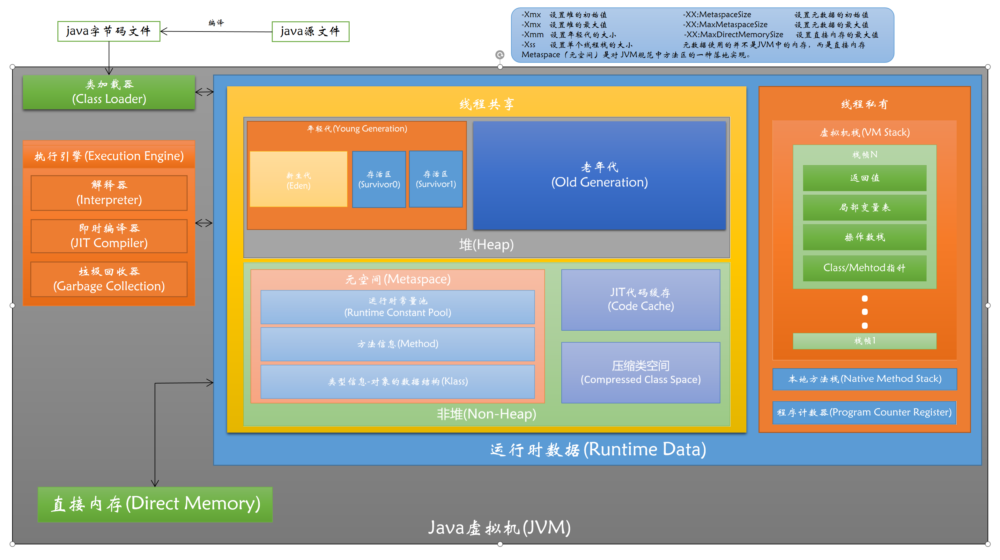

# 第一周作业
## 第一课 JVM 核心技术--基础知识
1. （**选做**）自己写一个简单的 Hello.java，里面需要涉及基本类型，四则运行，if 和 for，然后自己分析一下对应的字节码，有问题群里讨论。
   > Hello.java
   ```
    /**
     * @Description
     * @auther Movo
     * @create 2021/1/11 10:16
     */
    public class Hello {
        public static void main(String[] args) {
            // byte short int long float double boolean char
            byte byteType = 'I';
            short shortType = 8;
            int intType = 3;
            long longType = 3;
            float floatType = 4;
            double doubleType = 5;
            boolean booleanType;
            char charType = 'm';
            if(shortType + intType == longType) {
                for(int i = 0;i < floatType;i++) {
                    charType += doubleType;
                }
            }
            booleanType = charType != 'm';
            if(booleanType) {
                System.out.println(charType + "=666" + byteType);
            }
        }
    }
    
    ```
   > 编译Hello.java为Hello.class，并执行javap -c Hello，分析字节码如下：
    ```
   Compiled from "Hello.java"
   public class Hello {
     // 构造函数部分,由于源码中没有写构造函数，那么默认会产生一个空构造函数，以下字节码执行的应该为super()即父类的构造函数。
     public Hello();
       Code:
          // 将this对象压入操作栈
          0: aload_0
          // invokespecial调用该类父类的构造函数，该类继承于java.lang.Object
          1: invokespecial #1                  // Method java/lang/Object."<init>":()V
          // 返回
          4: return
     // main函数部分
     public static void main(java.lang.String[]);
       Code:
          // bipush:valuebyte值带符号扩展成int值入栈。
          // 字节'I'对应数值为73,将73带符号扩展成int值入栈。
          0: bipush        73
          // 弹出栈顶int类型值，保存到局部变量表第1个位置。
          2: istore_1
          // 将short值8带符号扩展成int值入栈。
          3: bipush        8
          // 弹出栈顶int类型值，保存到局部变量表第2个位置。
          5: istore_2
          // 将常量3压入操作数栈。
          6: iconst_3
          // 弹出栈顶int类型值，保存到局部变量表第3个位置。
          7: istore_3
          // ldc2_w:常量池中常量（long, double）入栈。
          // 将常量池中#2所代表的常量入栈。
          8: ldc2_w        #2                  // long 3l
         // 弹出栈顶long类型值，保存到局部变量4中。
         11: lstore        4
         // ldc:常量池中的常量值（int, float, string reference, object reference）入栈。
         // 将常量池中#4所代表的常量值入栈。
         13: ldc           #4                  // float 4.0f
         // 将栈顶float类型值保存到局部变量6中。
         15: fstore        6
         // 将常量池中#5所代表的常量入栈。
         17: ldc2_w        #5                  // double 5.0d
         // 弹出栈顶double类型值，保存到局部变量7中。
         20: dstore        7
         // 字符'm'对应数值为109,将109带符号扩展成int值入栈。
         22: bipush        109
         // 弹出栈顶int类型值，保存到局部变量表第10个位置。
         24: istore        10
         // 从局部变量2中装载int类型值入栈。
         26: iload_2
         // 从局部变量3中装载int类型值入栈。
         27: iload_3
         // 将栈顶两int类型数相加，结果入栈。
         28: iadd
         // 将栈顶int类型值转换为long类型值。
         29: i2l
         // 从局部变量4中装载long类型值入栈。
         30: lload         4
         // 比较并弹出栈顶两long类型值，前者大，1入栈；相等，0入栈；后者大，-1入栈。
         32: lcmp
         // 若栈顶int类型值不为0则跳转至索引64。
         33: ifne          64
         /************* shortType + intType == longType符合条件 开始循环 *************/
         // 0(int)值入栈。
         36: iconst_0
         // 弹出栈顶int类型值，保存到局部变量表第11个位置。
         37: istore        11
         // 从局部变量11中装载int类型值入栈。
         39: iload         11
         // 将栈顶int类型值转换为float类型值。
         41: i2f
         // 从局部变量6中装载float类型值入栈。
         42: fload         6
         // 比较栈顶两float类型值，前者大，1入栈；相等，0入栈；后者大，-1入栈；有NaN存在，-1入栈。
         44: fcmpg
         // 若栈顶int类型值大于等于0则跳转。
         45: ifge          64
         // 从局部变量10中装载int类型值入栈。
         48: iload         10
         // 将栈顶int类型值转换为double类型值。
         50: i2d
         // 从局部变量7中装载double类型值入栈。
         51: dload         7
         // 将栈顶两double类型数相加，结果入栈。
         53: dadd
         // 将栈顶double类型值转换为int类型值。
         54: d2i
         // 将栈顶int类型值截断成char类型值，后带符号扩展成int类型值入栈。
         55: i2c
         // 弹出栈顶int类型值，保存到局部变量表第10个位置。
         56: istore        10
         // 将整数值1加到11指定的int类型的局部变量中。
         58: iinc          11, 1
         61: goto          39
         /************* shortType + intType == longType符合条件 结束循环 *************/
         // 从局部变量10中装载int类型值入栈。
         64: iload         10
         // 字符'm'对应数值为109,将109带符号扩展成int值入栈。
         66: bipush        109
         // 若栈顶两int类型值相等则跳转至75。
         68: if_icmpeq     75
         // 1(int)值入栈。
         71: iconst_1
         72: goto          76
         // 0(int)值入栈。
         75: iconst_0
         // 弹出栈顶int类型值，保存到局部变量表第9个位置。
         76: istore        9
         // 从局部变量9中装载int类型值入栈。
         78: iload         9
         // 若栈顶int类型值为0则跳转至索引113。
         80: ifeq          113
         // 获取常量池中索引为#7的静态字段的值。
         83: getstatic     #7                  // Field java/lang/System.out:Ljava/io/PrintStream;
         // 创建常量池中索引#8的新的对象实例。
         86: new           #8                  // class java/lang/StringBuilder
         // 复制栈顶一个字长的数据，将复制后的数据压栈。
         89: dup
         // 调用#9的构造函数
         90: invokespecial #9                  // Method java/lang/StringBuilder."<init>":()V
         // 从局部变量10中装载int类型值入栈。
         93: iload         10
         // 根据#10调用对象的方法 append Char
         95: invokevirtual #10                 // Method java/lang/StringBuilder.append:(C)Ljava/lang/StringBuilder;
         // 常量池中的常量值#11入栈。
         98: ldc           #11                 // String =666
        // 根据#12调用对象的方法 append String
        100: invokevirtual #12                 // Method java/lang/StringBuilder.append:(Ljava/lang/String;)Ljava/lang/StringBuilder;
        // 从局部变量1中装载int类型值入栈。
        103: iload_1
        // 根据#13调用对象的方法
        104: invokevirtual #13                 // Method java/lang/StringBuilder.append:(I)Ljava/lang/StringBuilder;
        // 根据#14调用对象的方法
        107: invokevirtual #14                 // Method java/lang/StringBuilder.toString:()Ljava/lang/String;
        // 根据#15调用对象的方法
        110: invokevirtual #15                 // Method java/io/PrintStream.println:(Ljava/lang/String;)V
        // 返回
        113: return
   }
    ```
2. （**必做**）自定义一个 Classloader，加载一个 Hello.xlass 文件，执行 hello 方法，此文件内容是一个 Hello.class 文件所有字节（x=255-x）处理后的文件。文件群里提供。
    >HelloClassLoader.java
   ```
   import java.io.*;
   import java.lang.reflect.InvocationTargetException;
   import java.net.URLDecoder;
   
   /**
    * @Description
    * @auther Movo
    * @create 2021/1/12 8:47
    */
   public class HelloClassLoader extends ClassLoader {
   
       public static void main(String[] args) {
           try {
               Class<?> clazz = new HelloClassLoader().findClass("Hello");
               clazz.getMethod("hello").invoke(clazz.newInstance());
           } catch (ClassNotFoundException e) {
               e.printStackTrace();
           } catch (IllegalAccessException e) {
               e.printStackTrace();
           } catch (InstantiationException e) {
               e.printStackTrace();
           } catch (InvocationTargetException e) {
               e.printStackTrace();
           } catch (NoSuchMethodException e) {
               e.printStackTrace();
           }
       }
   
       @Override
       protected Class<?> findClass(String name) throws ClassNotFoundException {
           byte[] xlassBuffer = disposeBytes(loadBytes(name));
           return defineClass(name, xlassBuffer, 0, xlassBuffer.length);
       }
   
       private byte[] disposeBytes(byte[] xlassBuffer) {
           byte[] buffer = null;
           if(xlassBuffer != null) {
               buffer = new byte[xlassBuffer.length];
               int count = 0;
               for(byte tb : xlassBuffer) {
                   tb = (byte) (255 - tb);
                   buffer[count++] = tb;
               }
           }
           return buffer;
       }
   
       private String url2utf8(String str) {
           String result = null;
           try {
               result = URLDecoder.decode(str, "UTF-8");
           } catch (UnsupportedEncodingException e) {
               e.printStackTrace();
           }
           return result;
       }
   
       private byte[] loadBytes(String name) {
           byte[] buffer = null;
           try {
               String currentPath = url2utf8(this.getClass().getResource("/").getPath());
               File file = new File(currentPath + name + ".xlass");
               InputStream is = new FileInputStream(file);
               ByteArrayOutputStream os = new ByteArrayOutputStream();
               byte[] b = new byte[1024];
               int n;
               while ((n = is.read(b)) != -1) {
                   os.write(b, 0, n);
               }
               is.close();
               os.close();
               buffer = os.toByteArray();
           } catch (FileNotFoundException e) {
               e.printStackTrace();
           } catch (IOException e) {
               e.printStackTrace();
           }
           return buffer;
       }
   }

   ```
   > 用IEDA编译执行HelloClassLoader.java，结果如下：
   ```
   "C:\Program Files\Java\jdk1.8.0_172\bin\java.exe" "-javaagent:C:\Program Files\JetBrains\IntelliJ IDEA 2020.1.2\lib\idea_rt.jar=9682:C:\Program Files\JetBrains\IntelliJ IDEA 2020.1.2\bin" -Dfile.encoding=UTF-8 -classpath "C:\Program Files\Java\jdk1.8.0_172\jre\lib\charsets.jar;C:\Program Files\Java\jdk1.8.0_172\jre\lib\deploy.jar;C:\Program Files\Java\jdk1.8.0_172\jre\lib\ext\access-bridge-64.jar;C:\Program Files\Java\jdk1.8.0_172\jre\lib\ext\cldrdata.jar;C:\Program Files\Java\jdk1.8.0_172\jre\lib\ext\dnsns.jar;C:\Program Files\Java\jdk1.8.0_172\jre\lib\ext\jaccess.jar;C:\Program Files\Java\jdk1.8.0_172\jre\lib\ext\jfxrt.jar;C:\Program Files\Java\jdk1.8.0_172\jre\lib\ext\localedata.jar;C:\Program Files\Java\jdk1.8.0_172\jre\lib\ext\nashorn.jar;C:\Program Files\Java\jdk1.8.0_172\jre\lib\ext\sunec.jar;C:\Program Files\Java\jdk1.8.0_172\jre\lib\ext\sunjce_provider.jar;C:\Program Files\Java\jdk1.8.0_172\jre\lib\ext\sunmscapi.jar;C:\Program Files\Java\jdk1.8.0_172\jre\lib\ext\sunpkcs11.jar;C:\Program Files\Java\jdk1.8.0_172\jre\lib\ext\zipfs.jar;C:\Program Files\Java\jdk1.8.0_172\jre\lib\javaws.jar;C:\Program Files\Java\jdk1.8.0_172\jre\lib\jce.jar;C:\Program Files\Java\jdk1.8.0_172\jre\lib\jfr.jar;C:\Program Files\Java\jdk1.8.0_172\jre\lib\jfxswt.jar;C:\Program Files\Java\jdk1.8.0_172\jre\lib\jsse.jar;C:\Program Files\Java\jdk1.8.0_172\jre\lib\management-agent.jar;C:\Program Files\Java\jdk1.8.0_172\jre\lib\plugin.jar;C:\Program Files\Java\jdk1.8.0_172\jre\lib\resources.jar;C:\Program Files\Java\jdk1.8.0_172\jre\lib\rt.jar;F:\知识库\Java进阶训练营\作业\JAVA-01\Week_01\work\Hello\out\production\Hello" HelloClassLoader
   Hello, classLoader!
   
   Process finished with exit code 0
   ```
3. （**必做**）画一张图，展示 Xmx、Xms、Xmn、Meta、DirectMemory、Xss 这些内存参数的关系。

4. （**选做**）检查一下自己维护的业务系统的 JVM 参数配置，用 jstat 和 jstack、jmap 查看一下详情，并且自己独立分析一下大概情况，思考有没有不合理的地方，如何改进。

    **注意：**
     - 对于线上有流量的系统，慎重使用 jmap 命令。
     - 如果没有线上系统，可以自己 run 一个 web/java 项目。或者直接查看 idea 进程。
    ```
        S0C      S1C     S0U    S1U         EC               EU           OC               OU           MC          MU       CCSC   CCSU    YGC     YGCT    FGC    FGCT     GCT
    15360.0 16384.0  0.0   5201.1 3726336.0 2794609.8 5670400.0  4331151.8  94040.0  87664.2 10112.0 9151.0  12747  187.551  11      4.262  191.813  
    S0      S1         E         O        M     CCS     YGC      YGCT    FGC    FGCT      GCT
    0.00  23.97  39.27  76.38  93.22  90.50  12743  187.492    11     4.262   191.755
    平均每次young GC用时14.8毫秒
    Eden区使用率75%
    存活区使用率31.74%
    老年代使用率76.38%
    元数据区使用率93.22%
    类指针压缩区使用率90.5%
    
    Attaching to process ID 6692, please wait...
    Debugger attached successfully.
    Server compiler detected.
    JVM version is 25.144-b01
    
    using thread-local object allocation.
    Parallel GC with 13 thread(s)
    
    Heap Configuration:
       // JVM堆最小空闲比率
       MinHeapFreeRatio         = 0
       // JVM堆最大空闲比率
       MaxHeapFreeRatio         = 100
       // JVM堆的最大大小
       MaxHeapSize              = 17179869184 (16384.0MB)
       // 年轻代初始内存的大小
       NewSize                  = 357564416 (341.0MB)
       // 年轻代可被分配的内存的最大上限
       MaxNewSize               = 5726273536 (5461.0MB)
       // 老年代可被分配的内存的最大上限
       OldSize                  = 716177408 (683.0MB)
       // 年轻代:老年代 = 1:2
       NewRatio                 = 2
       // 存活区:伊甸区 = 2:8，即一个Survivor占年轻代的1/10
       SurvivorRatio            = 8
       // 元数据区初始大小
       MetaspaceSize            = 21807104 (20.796875MB)
       // 压缩类空间区大小
       CompressedClassSpaceSize = 1073741824 (1024.0MB)
       // 元数据区可被分配的内存的最大上限
       MaxMetaspaceSize         = 17592186044415 MB
       // G1每个Region的大小
       G1HeapRegionSize         = 0 (0.0MB)
    
    Heap Usage:
    PS Young Generation
    Eden Space:
       capacity = 3880255488 (3700.5MB)
       used     = 1395416024 (1330.7724227905273MB)
       free     = 2484839464 (2369.7275772094727MB)
       35.961962512917914% used
    From Space:
       capacity = 11010048 (10.5MB)
       used     = 2760680 (2.6327896118164062MB)
       free     = 8249368 (7.867210388183594MB)
       25.07418677920387% used
    To Space:
       capacity = 10485760 (10.0MB)
       used     = 0 (0.0MB)
       free     = 10485760 (10.0MB)
       0.0% used
    PS Old Generation
       capacity = 5806489600 (5537.5MB)
       used     = 4438568064 (4232.9483642578125MB)
       free     = 1367921536 (1304.5516357421875MB)
       76.44150544935101% used
    
    47669 interned Strings occupying 5426848 bytes.
    使用jstack -l查看，未发现死锁线程。
    ```
   >改进意见
   - 启动JVM没有关闭自适应参数:-XX:-UseAdaptiveSizePolicy，致使各区分配占比混轮，需要添加此参数 进行优化。
   - 应把-Xmx分配为系统可用内存的0.6-0.8, 而不是默认全部。
   - 改用CG为G1，提升JVM综合性能。
## 第二课 JVM 核心技术--工具与 GC 策略
1. （**选做**）本机使用 G1 GC 启动一个程序，仿照课上案例分析一下 JVM 情况。
    ```
    java -Xmx1g -Xms1g -XX:-UseAdaptiveSizePolicy -XX:+UseSerialGC -jar target/gateway-server- 0.0.1-SNAPSHOT.jar
    java -Xmx1g -Xms1g -XX:-UseAdaptiveSizePolicy -XX:+UseParallelGC -jar target/gateway-server- 0.0.1-SNAPSHOT.jar
    java -Xmx1g -Xms1g -XX:-UseAdaptiveSizePolicy -XX:+UseConcMarkSweepGC -jar target/gateway-server-0.0.1-SNAPSHOT.jar
    java -Xmx1g -Xms1g -XX:-UseAdaptiveSizePolicy -XX:+UseG1GC -XX:MaxGCPauseMillis=50 -jar target/gateway-server-0.0.1-SNAPSHOT.jar
    使用 jmap，jstat，jstack，以及可视化工具，查看 jvm 情况。 mac 上可以用 wrk，windows 上可以按照 superbenchmark 压测 http://localhost:8088/api/hello 查看 jvm。
    ```
   > 分析
   ```
   sb -u http://localhost:8088/api/hello -n 300000 -c 50
   16G内存 4核8线程CPU
   1. UseSerialGC           吞吐量 2615.8(requests/second)  GC次数 29  GC总耗时 0.127
   2. UseParallelGC         吞吐量 1822(requests/second)  GC次数 33  GC总耗时 0.120
   3. UseConcMarkSweepGC    吞吐量 2593.1(requests/second)  GC次数 30  GC总耗时 0.134
   4. UseG1GC               吞吐量 2532.5(requests/second)  GC次数 22  GC总耗时 0.083
   总体感觉综合看G1的吞吐量和延时是较其它要好的
   #jmap -heap
   1. 堆配置对G1完全没有效果，G1遵循自己的默认配置工作。
   2. G1堆分为1024个区，每个区大小为1M，总计大小1024M。  
   Eden共有238个区，使用92个。  
   Survivor共有20个区，使用20个。  
   老年代共有766个区，使用3个。
   #jmc 诊断命令VM.flags
   1. 作用同jcmd
   2. 配置信息
   
   // 编译线程数
   -XX:CICompilerCount=4
   // 并发GC的线程数量
   -XX:ConcGCThreads=2
   // 当使用G1收集器时，设置java堆被分割的大小。1048576/1024/1024=1M
   -XX:G1HeapRegionSize=1048576
   // 初始化堆大小
   -XX:InitialHeapSize=1073741824
   //
   -XX:MarkStackSize=4194304
   // 设置GC最大暂停时间。默认没有最大暂停时间。
   -XX:MaxGCPauseMillis=50
   // 最大堆大小
   -XX:MaxHeapSize=1073741824
   // 年轻代最大大小
   -XX:MaxNewSize=643825664
   // 每次扩展堆的时候最小增长
   -XX:MinHeapDeltaBytes=1048576
   // 禁止使用自适应分代大小
   -XX:-UseAdaptiveSizePolicy
   // 开启类压缩。用32bit位移表示64bit的类指针。默认开启。
   -XX:+UseCompressedClassPointers
   // 开启普通对象指针压缩，用32bit位移表示64bit的普通对象指针。默认开启。
   -XX:+UseCompressedOops
   // ?
   -XX:+UseFastUnorderedTimeStamps
   // 使用G1垃圾回收器
   -XX:+UseG1GC
   // ?
   -XX:-UseLargePagesIndividualAllocation
   ```
